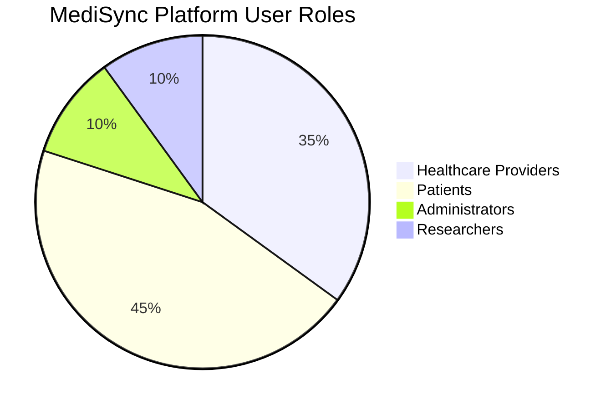
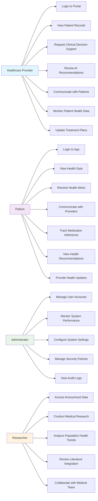

## Use Case Diagram

```mermaid
pie
    title MediSync Platform User Roles
    "Healthcare Providers" : 35
    "Patients" : 45
    "Administrators" : 10
    "Researchers" : 10

```

```mermaid
graph LR
    A[Healthcare Provider] --> B[Login to Portal]
    A --> C[View Patient Records]
    A --> D[Request Clinical Decision Support]
    A --> E[Review AI Recommendations]
    A --> F[Communicate with Patients]
    A --> G[Monitor Patient Health Data]
    A --> H[Update Treatment Plans]

    I[Patient] --> J[Login to App]
    I --> K[View Health Data]
    I --> L[Receive Health Alerts]
    I --> M[Communicate with Providers]
    I --> N[Track Medication Adherence]
    I --> O[View Health Recommendations]
    I --> P[Provide Health Updates]

    Q[Administrator] --> R[Manage User Accounts]
    Q --> S[Monitor System Performance]
    Q --> T[Configure System Settings]
    Q --> U[Manage Security Policies]
    Q --> V[View Audit Logs]

    W[Researcher] --> X[Access Anonymized Data]
    W --> Y[Conduct Medical Research]
    W --> Z[Analyze Population Health Trends]
    W --> AA[Review Literature Integration]
    W --> AB[Collaborate with Medical Team]

    style A fill:#e1f5fe
    style I fill:#f3e5f5
    style Q fill:#e8f5e8
    style W fill:#fff3e0
```